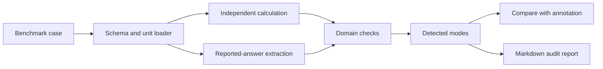

# MechAudit

[](https://github.com/500ft/MechAudit/actions/workflows/ci.yml)
[](https://www.python.org/)
[](LICENSE)

A Python CLI and benchmark suite for checking formulas, units, assumptions,
arithmetic, and reasoning in LLM-generated mechanical-engineering calculations.

**[Quick start](#quick-start) · [Benchmark results](reports/benchmark-results.md) · [Data and reports](docs/data-and-figures.md) · [Limitations](LIMITATIONS.md)**

## Overview

MechAudit loads a structured benchmark case, independently recomputes supported
mechanics quantities, extracts the model's reported work, and returns detected
failure modes. The evaluator compares that detected set with the case annotation
so verifier regressions can fail CI.



The current implementation covers thin-wall pressure vessels, axial stress,
cantilever controls, and finite-width stress concentration. It is a
domain-bounded verifier, not a general proof checker or a benchmark of overall
model capability.

## Quick start

```bash
python -m venv .venv
source .venv/bin/activate
python -m pip install -e ".[test]"
```

Audit one case:

```bash
mechaudit audit benchmark/synthetic/syn-fm01-0001.md \
  --output reports/syn-fm01-0001.md
```

Run the benchmark and test suite:

```bash
mechaudit eval benchmark/ --report reports/benchmark-results.md
pytest
```

`eval` exits nonzero if a complete case cannot load or if detected and expected
failure-mode sets differ. Pending cases are reported as skipped. The meaning of
the counts, case provenance, and report generation path are documented in
[`docs/data-and-figures.md`](docs/data-and-figures.md).

## CLI

| Command | Purpose |
| --- | --- |
| `mechaudit audit CASE` | Audit one benchmark case and optionally write a Markdown report |
| `mechaudit eval PATH` | Evaluate all cases under a directory and optionally write the aggregate table |
| `mechaudit capture` | Store a prompt, raw response, metadata, and SHA-256 digests without contacting a model |

## Documentation

| Document | Purpose |
| --- | --- |
| [`reports/benchmark-results.md`](reports/benchmark-results.md) | Current case-by-case evaluator output |
| [`docs/data-and-figures.md`](docs/data-and-figures.md) | Benchmark provenance, calculations, reports, and diagram lineage |
| [`docs/figure-manifest.json`](docs/figure-manifest.json) | Machine-readable map for documentation diagrams |
| [`benchmark/README.md`](benchmark/README.md) | Case layout, naming, and review checklist |
| [`docs/failure_taxonomy.md`](docs/failure_taxonomy.md) | Failure-mode definitions and detection rules |
| [`docs/schema_contract.md`](docs/schema_contract.md) | Structured case schema |
| [`docs/tolerance_policy.md`](docs/tolerance_policy.md) | Numeric comparison policy |
| [`docs/capture_provenance.md`](docs/capture_provenance.md) | Capture tiers, metadata, and digest rules |
| [`docs/real_case_classification_rubric.md`](docs/real_case_classification_rubric.md) | Captured-case classification process |
| [`LIMITATIONS.md`](LIMITATIONS.md) | Supported scope and interpretation limits |

## Repository map

```text
mechaudit/          CLI, loader, calculations, checks, capture, and report writer
benchmark/          synthetic, reference-control, captured, and pending cases
captures/           prompts, raw responses, metadata, hashes, and session notes
docs/               schema, taxonomy, tolerance, provenance, and data lineage
reports/            aggregate and single-case audit outputs
tests/              calculations, mutations, schema, provenance, and CLI tests
```

See [`CONTRIBUTING.md`](CONTRIBUTING.md) before adding a domain or failure mode.
MechAudit uses the [MIT License](LICENSE); third-party notices are in
[`NOTICE`](NOTICE).
