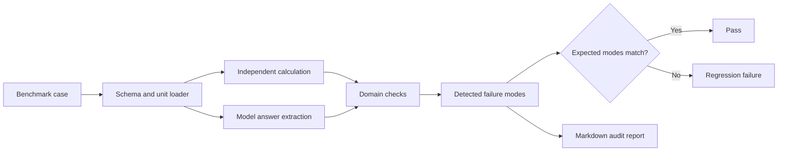
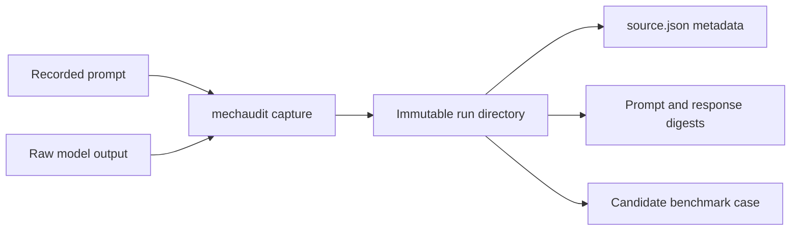

# MechAudit

[](https://github.com/500ft/MechAudit/actions/workflows/ci.yml)
[](https://www.python.org/)
[](LICENSE)

A Python CLI and benchmark suite for checking calculations, units, formulas,
assumptions, and reasoning in LLM-generated mechanical-engineering work.

**[Quick start](#quick-start) · [Audit pipeline](#audit-pipeline) · [Benchmark scope](#benchmark-scope) · [Capture protocol](#capture-protocol) · [Documentation](#documentation)**

## Overview

Engineering answers can arrive at a plausible number through the wrong formula,
an invalid assumption, or an inconsistent unit conversion. MechAudit compares
model outputs with independently recomputable benchmark cases and returns the
failure modes detected by its domain checks.

| | |
| --- | --- |
| **Interface** | Python CLI: `audit`, `eval`, and `capture` commands |
| **Current domains** | Thin-wall pressure vessels, axial stress, cantilever controls, and finite-width stress concentration |
| **Benchmark types** | Synthetic mutations, reference controls, and captured model outputs |
| **CI gate** | Detected modes must equal each case's expected modes |
| **Current version** | 1.0.0 |

## Audit pipeline



The batch evaluator does not accept a case because its metadata names a failure
mode. It recomputes the checks and compares the detected set with the expected
set. Reference cases with no expected failure protect against false positives.

## Quick start

```bash
python -m venv .venv
source .venv/bin/activate
python -m pip install -e ".[test]"
```

Audit one case and write a Markdown report:

```bash
mechaudit audit benchmark/synthetic/syn-fm01-0001.md \
  --output reports/syn-fm01-0001.md
```

Run the complete benchmark gate:

```bash
mechaudit eval benchmark/
pytest
```

`mechaudit eval` exits nonzero if a case fails to load or if detected and
expected modes differ, which makes it suitable for CI.

## Benchmark scope

| Mode | What the current verifier checks |
| --- | --- |
| `FM-01` | Unit conversion and dimensional inconsistency |
| `FM-02A` | Wrong governing formula |
| `FM-02B` | Missing or invalid assumptions |
| `FM-03` | Arithmetic or substitution errors |
| `FM-04` | Missing or misused stress-concentration factors |
| `FM-07` | Accepted final value paired with inconsistent reasoning |
| `FM-10` | Benchmark-accounting regression on a no-failure control |

Version 1 is limited to the committed benchmark domains. It is not a general
mechanical-engineering proof checker. See
[`LIMITATIONS.md`](LIMITATIONS.md) before applying the result to another domain.

## Capture protocol

The capture command stores the prompt, raw response, run metadata, and SHA-256
digests without calling a model or network service.



Current captured runs were produced under a preregistered challenge protocol;
they are not samples from ordinary user sessions.

| Capture group | Stored runs | Promoted benchmark cases |
| --- | ---: | ---: |
| Claude Haiku challenge | 10 | 3 `FM-04` cases |
| Codex comparison | 20 | 4 `FM-04` cases |
| Reviewer-authored pressure-vessel controls | 3 | 3 no-failure controls |
| Pending pressure-vessel slots | 2 | 0 |

The loader requires complete `real_world` cases to reference a raw artifact
whose digest matches the stored file. Full provenance rules are in
[`docs/capture_provenance.md`](docs/capture_provenance.md).

## Documentation

| Document | Purpose |
| --- | --- |
| [`benchmark/README.md`](benchmark/README.md) | Case layout, naming, and review checklist |
| [`docs/failure_taxonomy.md`](docs/failure_taxonomy.md) | Failure-mode definitions and detection rules |
| [`docs/schema_contract.md`](docs/schema_contract.md) | Structured case schema |
| [`docs/tolerance_policy.md`](docs/tolerance_policy.md) | Numeric comparison policy |
| [`docs/capture_provenance.md`](docs/capture_provenance.md) | Capture tiers, metadata, and digest rules |
| [`docs/real_case_classification_rubric.md`](docs/real_case_classification_rubric.md) | Classification process for captured cases |
| [`captures/README.md`](captures/README.md) | Capture workflow and directory format |
| [`ROADMAP.md`](ROADMAP.md) | Version boundaries and future domains |

## Repository map

```text
mechaudit/          CLI, loader, calculations, checks, and report writer
benchmark/          synthetic, reference-control, and captured-output cases
captures/           stored prompts, responses, metadata, and session notes
docs/               schema, taxonomy, tolerance, and provenance rules
prompts/             canonical capture prompts
tests/               calculations, mutations, schema, provenance, and CLI tests
```

## Contributing

See [`CONTRIBUTING.md`](CONTRIBUTING.md). Add a benchmark case before adding
verifier behavior whenever the new failure can be represented in the current
schema.

## License

MechAudit is available under the [MIT License](LICENSE). Third-party notices are
listed in [`NOTICE`](NOTICE).
