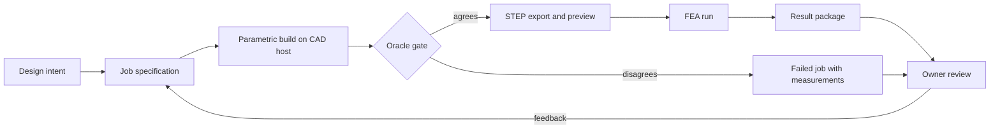

# CAD/FEA loop

This file describes the loop that turns a stated design intent into a built,
measured, and simulated part, and returns it for review. It exists so that the
loop's stages, contracts, and gates are checkable, and so that the stages which
are not yet implemented are not read as working.

## Purpose in this repository

`ROADMAP.md` scopes CAD/FEA capability as a way to harden ground truth: author
benchmark cases whose correct answer is confirmed by a model rather than by
hand analytics alone. The loop is that authoring path. It is deliberately
separate from the verifier: `mechaudit` checks calculations that a language
model produced, while `cadloop` produces geometry and measurements that a
future case can cite as its reference.

## Stages

| Stage | Contract | State |
| --- | --- | --- |
| Design intent to job specification | `cadloop/jobs/*.json`: template, parameter names with explicit units, oracle, tolerance, timeout | Implemented |
| Parametric build | `worker.py` sets only declared global variables, forces a full rebuild, walks every feature's error code | Implemented |
| Oracle gate | measured mass properties compared against a closed-form oracle within tolerance | Implemented |
| STEP export and preview | non-empty STEP file plus an isometric image, both verified to exist | Implemented |
| FEA run | STEP imported and solved, results returned as measurements | Not implemented |
| Result package and review | `result.json`, STEP, preview retrieved to `cadloop/runs/<job_id>/` | Implemented for the CAD half |
| Feedback to a new job | owner edits parameters and reruns | Implemented |

## Why the gate is the oracle and not the rebuild

`ForceRebuild3` returning true, and every feature reporting error code zero,
together prove that SOLIDWORKS raised no error. They do not prove the geometry
matches the request. An oversized hole, a parameter that was written to the
equation table but never reached a dimension, or a template whose links were
silently discarded all produce a clean rebuild and wrong geometry.

This is not hypothetical. An earlier run of the 150 x 80 x 6 mm job reported
success while returning 29 748.673 mm³ — the volume of the 100 x 60 x 5 mm
template it started from. The build was reported as passing because the only
volume check was that the volume exceeded zero. The oracle gate exists because
of that run, and would have failed it: the requested parameters imply
71 528.76 mm³, a 58 percent disagreement.

## Parameter rules

- A job may set only global variables the template declares. Unknown names fail
  the job before anything is modified.
- Values carry explicit units. A bare number is ambiguous between the document's
  unit system and the SOLIDWORKS API's metres, so it is rejected.
- Dimension-driving equations belong to the template and are never written by a
  job. A job writes declarations only.
- Omitted parameters keep the template's authored value, and every value the
  worker wrote is echoed in `result.json` with a read-back of the stored
  equation.

## What a result reports

`result.json` carries the job id, terminal status, the stage reached, resolved
parameters with read-backs, the volume comparison, body count, and artifact
names. A failure names the stage and, for a rebuild failure, the offending
feature and its error code.

`status: ok` means: one solid body, measurements within tolerance of the
oracle, a non-empty STEP file, a preview image, and — checked by the
orchestrator rather than the worker — those artifacts present on local disk.

## Not yet established

- **The FEA stage does not run.** A PyAnsys client is installed on the
  workstation and a gRPC path to a licensed MAPDL host is understood, but no
  job in this repository imports a STEP file, solves it, or returns stress or
  displacement results. Until it does, the loop is a build-and-measure loop.
- **The parametric re-drive is unproven.** The oracle gate is in place, but no
  committed run shows a template being driven to a second parameter set and
  measuring the new expected volume. That run is the loop's first acceptance
  test and has not been recorded.
- **One fixture, one configuration.** Coverage is a single plate template in
  its `Default` configuration. Configuration-specific equations, design tables,
  and externally linked equations are outside the contract.
- **Volume is the only gate.** Volume does not constrain hole position, so a
  correctly sized hole in the wrong place passes. Adding an independent
  position or mass-centre check is a coverage item, not a solved problem.
- **Host timing is unstable.** See `solidworks_api_findings.md`; a single open
  call has taken from seconds to over thirteen minutes on the reference host,
  which is why the orchestrator polls for a result file instead of trusting the
  launch call to return.
