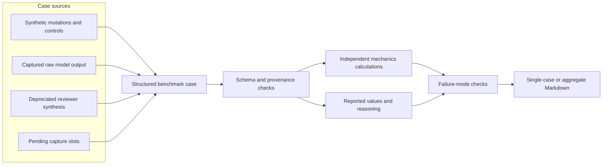

# Benchmark data, reports, and diagrams

This document explains how benchmark cases are created, how audit results are
computed, what the evaluator counts, and how the repository's documentation
diagrams are rendered.



## Evidence and provenance classes

| Class | Role |
| --- | --- |
| Synthetic positive | Hand-authored response mutation intended to isolate one implemented failure mode |
| Synthetic control | Analytically checked case with no expected failure mode |
| Gold captured case | Stored model response with immutable raw artifact and matching SHA-256 digest |
| Deprecated reviewer synthesis | Older response fixture without raw model provenance; retained as a control but not counted as captured model evidence |
| Pending capture | Reserved case excluded from evaluation until its required content and provenance exist |

The case schema stores source type, lifecycle status, provenance tier, prompt,
response, expected result, tolerances, formulas, inputs, and annotated failure
modes. See [`schema_contract.md`](schema_contract.md) and
[`capture_provenance.md`](capture_provenance.md).

## Current benchmark composition

| Group | Complete | Pending | Expected detected modes |
| --- | ---: | ---: | --- |
| Synthetic cases | 7 | 0 | Five single-mode positives and two no-failure controls |
| Gold captured stress-concentration cases | 7 | 0 | `FM-04` |
| Deprecated reviewer-synthesized pressure-vessel controls | 3 | 0 | None |
| Pressure-vessel capture slots | 0 | 2 | Not assigned |

The capture store contains 30 challenge-protocol raw runs: 10 Claude Haiku and
20 Codex runs. Seven stress-concentration outputs are promoted to complete Gold
benchmark cases. A stored run and a promoted benchmark case are different
counts; not every capture becomes a case.

## Audit calculation path

`mechaudit/case_loader.py` parses the fenced JSON case record, validates schema
and provenance requirements, and converts declared units. Domain calculators
under `mechaudit/` independently recompute supported reference quantities.
Checks compare those quantities, formulas, assumptions, and extracted reasoning
with the submitted answer using [`tolerance_policy.md`](tolerance_policy.md).

For a complete case, `passed` means the computed detected-mode set equals the
annotated expected-mode set. It does not mean the original model answer was
correct: a correctly detected failure case also produces a benchmark PASS.

## Aggregate results

Regenerate [`reports/benchmark-results.md`](../reports/benchmark-results.md):

```bash
mechaudit eval benchmark/ --report reports/benchmark-results.md
```

The current aggregate is 17 passed, 0 failed, and 2 skipped. The denominator is
the committed benchmark, not a representative sample of mechanical-engineering
questions. All seven captured failures exercise `FM-04`, so the result does not
measure captured-model detection for the other implemented modes.

Run the software regression suite separately:

```bash
pytest
```

The current suite contains 83 tests across calculations, unit handling,
synthetic mutations, real-world cases, capture hashes, schema rules, reports,
and CLI behavior.

## Single-case reports

```bash
mechaudit audit benchmark/real_world/rw-stress-concentration-claude-haiku-0001.md \
  --output reports/rw-stress-concentration-claude-haiku-0001.md
```

The report writer records the case source, expected and detected failure modes,
recomputed quantities, individual check results, and diagnostics. The two
committed example reports are generated text, not separate experiments.

## Capture data

`mechaudit capture` does not call a model. It packages an already recorded
prompt and response with model metadata, run settings, timestamps, raw artifact
paths, and digests. `source.json` is the manifest for a run. Tests recompute the
hashes and require promoted real-world cases to point to their own matching raw
artifact.

Capture commands, model metadata, and session context are under `captures/`.
The challenge protocol is not intended to represent ordinary user traffic.

## Documentation diagrams

The audit and capture pipeline diagrams are Mermaid source embedded in Markdown
and rendered by GitHub. They explain control flow and provenance; they are not
plots of benchmark measurements. The repository currently has no static chart
or image output.

See [`figure-manifest.json`](figure-manifest.json) for their machine-readable
lineage.
